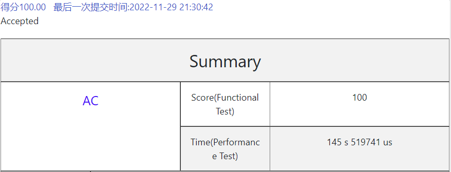
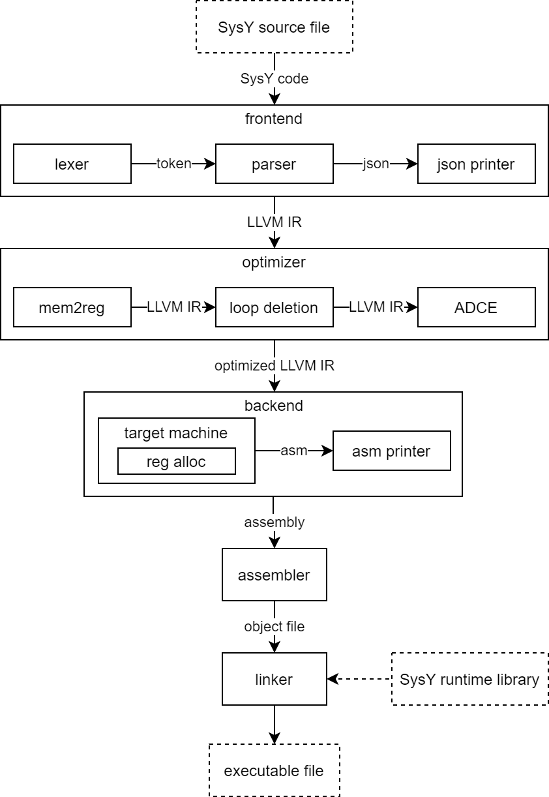
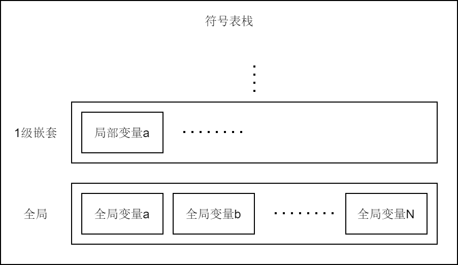
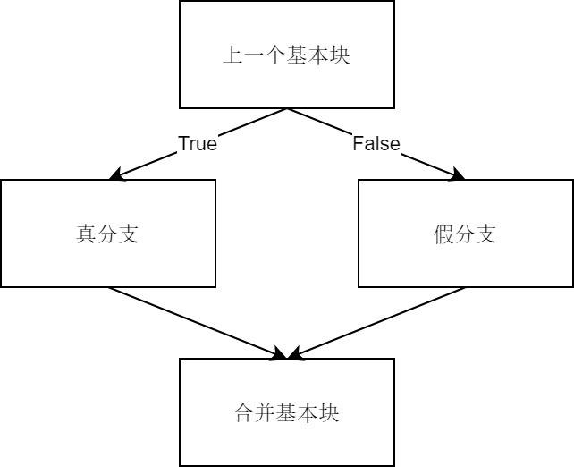
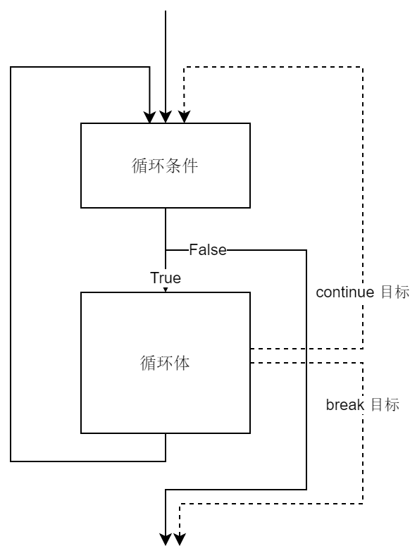
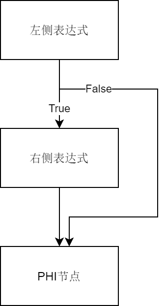

# SysY语言编译器设计报告

## 简介

在本学期的课程中，我（邹先予）与许渊轶同学共同完成了SysY语言编译器的设计、编程和测试工作。并最终通过了希冀平台上的所有功能测试样例与性能测试样例。



## 技术选型

在技术选型环节，首先我参考了现代编译器主流的设计方法，包括Rust、C++等语言的编译器设计很多都是基于LLVM基础设施的，并且我本人接触过安全领域的Obfuscator-LLVM相关的开发工作，因此选定了基于LLVM基础设施进行SysY语言的编译器开发。

目前的大多数语言出于对语言的语法复杂度、性能的考虑，都是自己实现的词法分析器、语法分析器。有一些编译器开发相关的教程由于语法非常简单（比如LLVM教程中的Kaleidoscope语言），因此词法分析器使用的是手写递归下降算法。但是在SysY语言的编译器设计中，考虑到SysY语言的语法较为简单，Flex和Bison完全可以处理这种语法，并且SysY语言的语法规则的数量比Kaleidoscope语言多一些，如果手写递归下降算法代码量会比较大。因此在技术选型阶段暂定了Flex和Bison作为SysY编译器的词法分析器和语法分析器。

在后续编程实践阶段，我发现Flex无法正确解析我提供的正则表达式（在regex101网站测试正常），并且文档不够充分，因此我选择弃用Flex词法分析器，基于C++11提供的regex库自己实现一个词法分析器。

在项目的构建系统上，我们选择了cmake，这里主要是考虑cmake是目前比较主流的C/C++构建系统，我的很多项目也是使用cmake进行构建的。相比于make，我对cmake更加熟悉。并且在cmake中还包含了ctest测试工具，可以让我们更加方便的进行编译器测试工作。

## 程序架构



程序架构如图所示，在编译器前端包括词法分析器、语法分析器和语法树打印工具。其中词法分析器是基于C++11的regex库进行开发的，用于将输入的SysY语言程序文件转换成token流输入到语法分析器中。语法分析器是基于Bison实现的，用于将token流转换成AST。为了更加方便地调试程序逻辑，在生成AST之后我又加入了一个json打印模块，用于将AST转换成json格式，并打印到标准输出。

然后我们遍历AST，对数组相关节点进行修复，这部分将在后续展开讲解。在对AST进行调整后，再次遍历AST，生成LLVM IR。

在下一阶段，将生成的LLVM IR输入到optimizer，在目前我们共实现了3个pass，包括mem2reg、loop deletion和ADCE。

然后我们将得到的优化后的LLVM IR输入给LLVM后端，在这里我们实现了自己的寄存器分配算法，然后生成arm汇编代码。

最后，汇编代码还需要再经过汇编器、链接器，最终得到arm可执行程序文件。

## 符号表



首先我们设计了符号表。为了符合SysY语言的变量生命周期与作用域的规定，在这里的符号表被设计成了一个栈。栈中的每个元素都是一个map，用于存储在该层的所有变量、常量信息。

由于在后续不同阶段会使用到不同类别的符号表，因此在代码中符号表被设计成了一个类模板。后续阶段的代码可以实例化出不同类型的符号表。

```c++
template <typename Ty>
class SymbolTable {
    std::list<std::map<std::string, Ty>> symbolStack;
public:
    // 构造函数，负责创建一个全局符号表
    SymbolTable() {
        log("sym_table") << "new symbol table" << std::endl;

        // 创建一个空的符号表作为全局符号表
        symbolStack.emplace_back();
    }
    
    ...
};
```

### 进入、退出代码块

在进入退出代码块时，我们需要调整符号表的层级，在进入一个新的代码块时，我们需要向栈中插入一层新的map。当退出一个代码块时，我们需要将栈顶的map移除。

```c++
// 创建一个新的局部符号表
void push() {
    size_t level = symbolStack.size();
    log("sym_table") << "[" << level << "->" << (level + 1) << "] push" << std::endl;

    // 创建一个空的符号表作为局部符号表
    symbolStack.emplace_back();
}

// 弹出当前作用域的局部符号表
void pop() {
    size_t level = symbolStack.size();
    log("sym_table") << "[" << level << "->" << (level - 1) << "] pop" << std::endl;

    //当前作用域结束，弹出局部符号表
    symbolStack.pop_back();
}
```

### 插入

在插入一个新的变量时，我们应该将其插入在符号表栈顶的map中。并且我们需要检查是否存在变量重定义。

```c++
// 向当前作用域的局部符号表插入一个符号
void insert(const std::string &name, Ty value) {
    size_t level = symbolStack.size();
    log("sym_table") << "[" << level << "] insert '" << name << "'" << std::endl;

    // 判断重复情况
    auto &currScope = symbolStack.back();
    if (currScope.find(name) != currScope.end()) {
        throw std::runtime_error("symbol '" + name + "' already exists");
    }

    // 插入一个符号到当前作用域的符号表
    symbolStack.back()[name] = value;
}
```

### 查询

在查询时，我们需要从最顶层的栈开始，一层一层地向下查找。在这里提供了两个查询函数，tryLookup函数在查找失败时不会抛出异常，这个函数会在常量求值时使用到。lookup函数是对tryLookup的封装，主要用于必须查找到的情况，比如LLVM IR生成阶段，这个函数在查找失败时会抛出异常。

```c++
// 从当前作用域开始向上查找符号
Ty tryLookup(const std::string &name) {
    size_t level = symbolStack.size();

    // 从当前作用域开始向上查找符号
    for (auto it = symbolStack.rbegin(); it != symbolStack.rend(); it++) {
        log("sym_table") << "[" << level-- << "] find '" << name << "'" << std::endl;
        auto item = it->find(name);
        if (item != it->end()) {
            return item->second;
        }
    }

    // 如果找不到，则返回nullptr
    log("sym_table") << "'" << name << "' not found" << std::endl;
    return nullptr;
}

// 当查找不到时，抛出异常
Ty lookup(const std::string &name) {
    auto value = tryLookup(name);
    if (value == nullptr) {
        throw std::runtime_error("symbol '" + name + "' not found");
    }
    return value;
}
```

## 词法分析器

在一开始的设计中，我们选用了Flex作为词法分析器，但是在编程的过程中发现Flex存在一些问题，无法正确解析提供的正则表达式，因此在后续开发过程中基于C++11提供的regex正则表达式库实现了一个简单的词法分析器。

### 词法分析器框架设计

词法分析器主要由正则表达式相关算法、正则表达式及对应语义动作组成。首先我们需要定义一个数组，用于存储所有的正则表达式和语义动作，其中为了使代码看起来更美观，这里的语义动作使用C++的lambda表达式进行编写。

```c++
#define T_CALLBACK [](const std::string &str) -> std::optional<int>

static Pattern patterns[]{
        {"pattern0", T_CALLBACK {
            ...
        }},
        {"pattern1", T_CALLBACK {
            ...
        }},
        {"pattern2", T_CALLBACK {
            ...
        }},
        
        ...
}

#undef T_CALLBACK
```

然后我们需要使用C++的regex库编译这些正则表达式，在这里需要注意的是，出于对性能的考虑，为了实现线性时间的词法分析器，我们需要把这些正则表达式组合起来，组合成一个完整的正则表达式，然后根据每一个匹配对应的匹配组，调用对应的语义动作。

我们需要将原有正则表达式组合起来，可以由如下代码实现。

```c++
std::string regexMerge;
for (const Pattern &pattern: patterns) {
regexMerge += "(" + pattern.regex + ")|";
}
// 去除最后一个竖线
regexMerge.pop_back();
```

但是在这里会存在着问题，就是原有正则表达式已经包含了括号，就会破坏已有的正则表达式编号，因此我们需要将所有待组合的正则表达式进行修改，将其中的括号修改为非捕获组，这样就可以确保只有在合并时的括号才是捕获组，因此就可以实现通过匹配的捕获组序号找到对应的语义动作了。

```c++
// 查找前面不是斜杠的括号，替换成非捕获组
std::string Pattern::fixGroup(const std::string &pattern) {
    std::string dummyPattern = "Z" + pattern;
    std::string fixedPattern;
    fixedPattern.reserve(pattern.length());
    for (int i = 1; i < dummyPattern.length(); i++) {
        if (dummyPattern[i] == '(' && dummyPattern[i - 1] != '\\') {
            fixedPattern += "(?:";
        } else {
            fixedPattern += dummyPattern[i];
        }
    }
    return fixedPattern;
}
```

这样我们就可以将正则表达式规则应用在输入的SysY程序代码上，然后得到token流。

```c++
regex = std::regex(regexMerge);
it = std::sregex_iterator(input.begin(), input.end(), regex);
end = std::sregex_iterator();

...

retry:
if (it == end) {
    return std::nullopt;
}

for (int i = 0; i < it->size(); i++) {
    if ((*it)[i + 1].matched) {
        std::string str = (*it)[i + 1].str();
        std::optional<int> token = patterns[i].callback(str);
        changeRowCol(str, currRow, currCol);
        it++;
        if (token) {
            return token;
        }
        goto retry;
    }
}
```

除此之外，SysY语言程序在性能测试中会使用到\_\_LINE\_\_宏，这个宏的含义是引用当前行号。

```c++
#define starttime() _sysy_starttime(__LINE__)
#define stoptime() _sysy_stoptime(__LINE__)
```

因此我们有必要在词法分析器中记录token的行号列号信息。在这里我们通过识别词素中包含的换行符信息以及词素的长度来更新行列号信息。比如对于词素“int”，其长度为3，其中不包含换行符，因此行号不变，列号+3。再比如对于以下块注释词素：

```
/*aaa
bbb*/
```

在这里包含了1个换行符，因此行号需要+1，然后从最后一个换行符开始统计字符数，是5，因此需要将列号置为5。

计算行号列号的代码如下。

```c++
void Lexer::changeRowCol(const std::string &str, size_t &row, size_t &col) {
    // 计算新行号
    size_t newLineCount = std::count_if(str.begin(), str.end(),
                                        [](char c) { return c == '\n'; });
    row += newLineCount;

    // 计算新列号
    if (size_t lastNewLinePos = str.find_last_of('\n');
        lastNewLinePos != std::string::npos) {
        col = str.length() - lastNewLinePos;
    } else {
        col += str.length();
    }
}
```

### SysY语言相关正则表达式设计

在正则表达式的设计中，其中较为较为复杂的规则以宏定义的方式放置在了lexer_pattern.inc文件的头部。

其中包括：

- 块注释
- 行注释
- 空白符
- 换行符
- 标识符
- 整型字面值常量（10进制、16进制、8进制）
- 浮点型字面值常量（10进制、16进制），包括科学计数法表示

#### 块注释

```c++
#define P_BLOCK_COMMENT         R"(\/\*(.|\r|\n)*?\*\/)"
```

块注释的正则表达式首先包括块注释的左侧部分，也就是"/*"符号，然后就是中间的注释部分。在这里需要注意，中间的注释部分需要是非贪婪匹配，否则会出现问题。如下面的例子：

```
/* xxx */
int a = 0;
/* xxx */
```

如果使用贪婪匹配模式，则会从第一个"/\*"符号匹配到最后一个"\*/"，这样就会导致第二行代码也被认为是注释，这就出现了错误。因此我们需要在遇到第一个块注释终止符号"\*/"时就结束匹配，非贪婪模式就可以解决这个问题。

#### 行注释

```c++
#define P_LINE_COMMENT          R"(\/\/.*(\r\n|\r|\n))"
```

行注释首先要匹配行注释开始符号"//"，然后匹配到换行符。在这里需要注意，由于在Linux、Windows、Mac OSX上的换行符均不相同，这里需要匹配3种换行符。

#### 空白符

```c++
#define P_WHITESPACE            R"([\t ]+)"
```

对于制表符和空格，我们都认为是空白符。

#### 换行符

```c++
#define P_NEWLINE               R"(\r\n|\r|\n)"
```

像行注释一样，在这里也需要考虑不同系统的换行符不同的问题。

#### 标识符

```c++
#define P_IDENTIFIER            R"([A-Za-z_][A-Za-z0-9_]*)"
```

标识符是字母或下划线开头，后接多个字母、数字或下划线组成的。

#### 整型字面值常量

```c++
#define P_VALUE_INT             R"((0[Xx][0-9A-Fa-f]+)|(0[0-7]+)|([1-9]\d*|0))"
```

整型字面值常量包括10进制、16进制、8进制这三种情况，分类讨论即可。

#### 浮点型字面值常量

```c++
#define P_VALUE_FLOAT_DEC       R"((((\d*\.\d+)|(\d+\.))([Ee][+-]?\d+)?)|(\d+([Ee][+-]?\d+)))"
#define P_VALUE_FLOAT_HEX       R"(0[Xx]((([0-9A-Fa-f]*\.[0-9A-Fa-f]+)|([0-9A-Fa-f]+\.))([Pp][+-]?\d+)|[0-9A-Fa-f]+([Pp][+-]?\d+)))"
#define P_VALUE_FLOAT           "(" P_VALUE_FLOAT_DEC ")|(" P_VALUE_FLOAT_HEX ")"
```

浮点型字面值常量包括的情况较多，在此参考了C99标准。在这里分开写成了两个正则表达式，最后再组合起来。其中第一个正则表达式描述的是十进制浮点型，其中小数部分可以是“1.1”，“1.”，“.1”这三种情况，然后指数部分是可选的，在指数部分首先是指数标记”E“或”e“，然后是可选的指数符号，最后就是指数部分的具体数值了。比如合法的指数部分可以是“E9”，“E+9”，“E-9”，“e9”等等情况。除此之外，如果有指数部分，小数部分还可以是整型而不是浮点型。比如“1e9”这种情况。

十六进制字面值常量与十进制情况类似，也有多种情况需要讨论。

#### 其他正则表达式

其他正则表达式较为简单，比如“int”，“float”等，在此就不一一展开了。需要注意的是，为了解决保留字作为标识符前缀的情况，比如”intValue“这个标识符，如果直接匹配，则”int“会被匹配为一个词素，就出现了错误。因此我们需要修改“int”的正则表达式，在后面加上“\b”，表示匹配单词边界，“intValue”就不满足“int\b”这个正则表达式了，从而可以继续搜索，匹配到优先级更低的标识符的正则表达式。

### 语义动作

在每个正则表达式中，首先我们调用日志函数进行调试信息输出，然后返回对应的token，输入到语法分析器中。为了表达无词素这个含义，比如换行符，空白符等，在代码中使用到了C++17的optional容器，返回std::nullopt表示的是无词素，返回其他值表示有词素。以换行符和“int”的正则表达式为例：

```c++
{P_NEWLINE,       T_CALLBACK {
    return std::nullopt;
}},
```

```c++
{R"(int\b)",      T_CALLBACK {
    Lexer::log("TYPE_INT", str);
    return TYPE_INT;
}},
```

## 语法分析器

我们基于Bison实现了SysY语言的语法分析器。其中有3个部分的工作需要完成：

1. 设计AST
2. 用上下文无关文法表达SysY语法
3. 在上下文无关文法中加入语义动作，用于在运行时构建AST

### 设计AST

AST设计的质量直接关系到了后续IR生成阶段的复杂度，因此我们在AST上进行了精心的设计。

首先我们需要设计一个基类，这是所有AST节点的基类，在后续对AST进行遍历时，大多数情况下使用的是基类指针，以实现多态。

```c++
struct Base {
    virtual llvm::json::Value toJSON() {
        throw std::logic_error("not implemented");
    }

    virtual llvm::Value *codeGen() {
        throw std::logic_error("not implemented");
    }

    virtual void constEval(Base *&root) {
        throw std::logic_error("not implemented");
    }

    virtual ~Base() = default;
};
```

然后我们需要设计子类的继承关系，需要有3个大类，分别是Stmt、Expr和Decl。后续更加细分的子类会继承自这些父类。

```c++
struct Stmt : Base {
};
struct Expr : Base {
};
struct Decl : Base {
};
```

#### 编译单元

编译单元代表了整个SysY源程序文件，这是AST的根节点。其中存储着compileElements，一般是全局变量、全局常量、函数的AST节点。

```c++
struct CompileUnit : Base {
    // 存储：常量、变量声明 或 函数定义
    std::vector<Base *> compileElements;
    
    ...
};
```

#### 初始化元素、初始化列表

初始化元素用于代表变量/数组的初值。在SysY语言中需要支持普通变量和数组变量，比如对于以下变量定义，初始化元素代表的是1、{1, 2, 3}。

```
int a = 1;
int b[3] = {1, 2, 3};
```

在这里有一个问题，就是对于1来说，这是一个表达式，对于{1, 2, 3}来说，这是一个初始化列表。在初始化元素中，可以存储的是表达式或初始化列表。这个关系在C语言中可以用联合体union来表达，在C++17中提供了更加友好的variant容器，其用途与联合体是相似的。因此我们可以这样设计初始化元素和初始化列表。

```c++
struct InitializerElement : Base {
    std::variant<Expr *, InitializerList *> element;

    ...
};

struct InitializerList : Base {
    std::vector<InitializerElement *> elements;

    ...
};
```

#### 变量、数组定义

对于变量、数组定义，可以有以下的形式：

```c++
int a = 1, b, c[3] = {1, 2, 3};
```

这一行都是一个变量定义，其中包含了3个变量，其中a的初值是1，b没有初值，c是一个数组，初值是初始化列表{1, 2, 3}。对于每个变量，我们用VariableDef来表示，其中包含名称、数组维度信息和初值。对于整体3个变量，我们用VariableDecl来表示，其中有类型信息和VariableDef的数组。

```c++
struct VariableDef : Base {
    std::string name;
    std::vector<Expr *> size;
    InitializerElement *initVal;
    
    ...
};

struct VariableDecl : Decl {
    Typename type;
    std::vector<VariableDef *> variableDefs;

    ...
};
```

#### 函数定义

在函数定义中，需要有返回值类型、函数名称、函数形参表、函数体。其中函数参数需要记录参数的基本类型信息，参数名称和参数的数组维度信息。函数体较为简单，直接存储基类指针即可。

```c++
struct FunctionArg : Base {
    Typename type;
    std::string name;
    std::vector<Expr *> size;

    ...
};

struct Block : Base {
    std::vector<Base *> elements;

    ...
};

struct FunctionDef : Base {
    Typename returnType;
    std::string name;
    std::vector<FunctionArg *> arguments;
    Block *body;

    ...
};
```

#### 语句

语句包含赋值语句、表达式语句、空语句、语句块、if语句、while语句、break语句、continue语句、return语句。

以赋值语句为例，赋值语句需要包含左值和右值。这需要在AssignStmt中分别存储，其中左值需要用单独的容器存储，其中包括变量名称和数组维度信息。

```c++
struct LValue : Base {
    std::string name;
    std::vector<Expr *> size;

    ...
};

struct AssignStmt : Stmt {
    LValue *lValue;
    Expr *rValue;

    ...
};
```

#### 表达式

表达式包括一元表达式、二元表达式、函数调用表达式、字面值常量表达式、变量表达式。

以二元表达式为例，需要存储运算符和左右操作数。

```c++
struct BinaryExpr : Expr {
    Operator op;
    Expr *lhs;
    Expr *rhs;

    ...
};
```

### 设计上下文无关文法及语义动作

在SysY语言定义中，已经给出了拓展的文法。在Bison中使用的时候我们需要将其转换为标准的上下文无关文法格式。

在转换的过程中主要是遇到了如下的问题：

1. 解决if-else配对问题
2. 以线性数据结构存储AST的子节点
3. 内存管理

#### 解决if-else配对问题

在这里我使用到了Bison中的优先级功能，我们可以通过手动设置then语句和else语句的优先级，来实现让else和最近的if配对。

首先我们需要设置then和else语句的优先级。

```
%precedence THEN
%precedence ELSE
```

然后，在if的上下文无关文法中，使用这两个符号。

```
| IF LPAREN condition RPAREN stmt %prec THEN {
    ...
}
| IF LPAREN condition RPAREN stmt ELSE stmt {
    ...
}
```

#### 以线性数据结构存储AST的子节点

我们在设计AST时，为了简化后续的编程工作，全部使用了线性数据结构vector来存储AST的子节点。这里就存在了一个问题，比如对于下面的文法，描述的是一个变量列表，如果完全按照文法来构建AST，AST的存储方式是一个左偏的二叉树，而我们希望得到线性的存储方式，这里就出现了冲突。

```
var_def_list
    : var_def_list COMMA var_def {
        ...
    }
    | var_def {
        ...
    }
    ;
```

我们通过一个设计解决了这个问题。在第一步规约的时候，一定是使用的第二个文法，因此在第二个文法对应的语义动作中，我们就可以申请一个var_def_list节点，并将当前的var_def节点作为子节点插入到var_def_list节点的子节点数组中。然后后续就会使用第一个文法进行规约，此时说明已经执行完了第二个文法对应的语义动作，var_def_list节点已经有了内存空间，并且前序的子节点已经插入到了var_def_list节点的子节点数组中，此时只需要把新的var_def节点从后面插入到这个数组中即可，然后再把这个var_def_list节点赋值给根节点。这样就可以实现树形结构到线性结构的转换了。具体代码如下。

```
var_def_list
    : var_def_list COMMA var_def {
        $1->variableDefs.emplace_back($3);
        $$ = $1;
    }
    | var_def {
        $$ = Memory::make<AST::VariableDefList>();
        $$->variableDefs.emplace_back($1);
    }
    ;
```

#### 内存管理

在一开始的设计中，我们打算使用C++的智能指针来解决AST可能存在的内存泄露问题，降低内存管理的编程负担。但是在编程过程中发现，bison对C++智能指针的支持并不友好，由于bison在传参时使用的是值传参，因此会出现调用拷贝构造函数的问题，但是unique_ptr为了确保唯一引用，其拷贝构造函数是delete的，所以我们没办法在bison中使用unique_ptr。

通过分析AST的特性，其内存是在构造AST阶段大量申请内存，这些内存暂时不会被释放，直到IR生成阶段结束，这个AST的内存才应该被释放。因此我们可以给new再套一层函数，用于追踪所有的内存申请。当IR生成阶段结束后，再统一进行释放。这样我们就既解决了智能指针潜在的循环引用问题，又避免了申请的内存忘记释放，从而导致内存泄露的问题。

在内存申请时，我们需要记录所有的申请请求。

```c++
namespace Detail {
    extern std::vector<std::function<void()>> destructors;
}

template<typename Ty, typename... Args>
Ty *make(Args &&... args) {
    Ty *ptr = new Ty(std::forward<Args>(args)...);
    Detail::destructors.emplace_back([ptr] { delete ptr; });
    return ptr;
}
```

在IR生成阶段结束后，AST不再会被使用，因此我们应该释放AST占用的内存。

```c++
void freeAll() {
    for (const auto &destructor: Detail::destructors) {
        destructor();
    }
    destructors.clear();
}
```

## json打印模块

为了更加方便的观察AST的正确性，在这里使用到了json打印功能，在这里使用的是llvm提供的json模块，我们还可以使用。这个模块会遍历整棵AST，将AST转储为json格式并打印到标准输出中。为了减少内存拷贝带来的性能开销，在代码中使用到了移动语义。以编译单元的json生成代码为例。

```c++
llvm::json::Value AST::CompileUnit::toJSON() {
    llvm::json::Object obj;
    obj["NODE_TYPE"] = "CompileUnit";
    llvm::json::Array jsonCompileElements;
    for (auto &compileElement: compileElements) {
        jsonCompileElements.emplace_back(compileElement->toJSON());
    }
    obj["compileElements"] = std::move(jsonCompileElements);
    return obj;
}
```

## AST调整

在生成LLVM IR之前，我们需要解决以下几个问题：

1. 常量编译期求值
2. 数组维度表达式求值
3. 数组初始化列表规范化

### 常量编译期求值

常量编译期求值主要是为了解决这样的问题，比如对于以下常量定义：

```c++
const int N = 4 / 2;
```

在AST中存储的N的初值是一个二元表达式，运算类型是除法，二元表达式的左右表达式分别是字面值常量表达式4和2。在AST调整阶段，我们需要在编译期进行常量求值，将二元表达式的计算结果2作为N的初值。这样在下一个阶段，生成LLVM IR的时候就可以方便地生成N这个常量了。

除此之外，对于常量，我们还应该在这个阶段将其存储到常量符号表中，这主要是为了处理数组维度的问题。比如对于以下数组定义，我们在看到第二行代码时，需要将变量表达式N替换成字面值常量表达式10，以便在后续生成LLVM IR的阶段，可以直接看到数组的第一维是10，这样就可以对arr生成LLVM IR了。因此，我们就有必要在这个阶段创建一个常量符号表，用于存储这些常量信息。

```c++
const int N = 10;
int arr[N];
```

在分析过程中，我们还发现了有一种比较难解决的情况。比如对于以下代码，首先我们需要对数组A进行规整化操作，然后将数组A整体存储到常量符号表中，最后在见到B的时候，才可以查询到A[0]的值，这样的话就会增加程序设计的复杂度。在SysY语言定义中没有明确指出这种情况是否会出现，我们在参考很多资料和SysY的测试样例后，确定这种情况不会出现，因此我们的程序设计可以进行简化。

```c++
const int A[3] = {1};
int B[A[0]];
```

因此在常量符号表中，只需要存储普通常量的值即可，不需要考虑数组常量。

```c++
// 常量求值符号表，仅存储普通常量，不存储数组常量
static SymbolTable<std::variant<int, float> *> constEvalSymTable;
```

### 数组维度表达式求值

在SysY语言中规定，数组的维度可以是常量表达式，比如下面的SysY代码，其处理方式与常量编译期求值类似，我们同样需要遍历数组定义中的各维度的表达式，对其进行编译期求值，然后将得到的计算结果作为字面值常量表达式将原来的表达式替换掉。

```
int A[2][8/2][1*3];
```

### 数组初始化列表规范化

这是关于数组的一个比较困难的问题，在SysY语言定义中，以下的这些数组初始化列表均是合法的。而在LLVM IR中，数组的初始化列表的所有初值必须是确定的，因此我们就需要对数组的初始化列表进行规范化，将数组a、b、d全部转换为类似于c的规范形式，我们需要设计一些算法来解决这个问题。

```
int a[4][2] = {};
int b[4][2] = {1, 2, 3, 4, 5, 6, 7, 8};
int c[4][2] = {{1, 2}, {3, 4}, {5, 6}, {7, 8}};
int d[4][2] = {1, 2, {3}, {5}, 7 , 8};
```

我们设计了两个步骤来解决这个问题，第一步是展开，我们需要将初始化列表中所有元素展开成1维的形式，然后对于每个元素不足的初始化列表补充0元素。这样，abcd四个数组的初始化列表就变成了如下的形式。

```
int a[4][2] = {0, 0, 0, 0, 0, 0, 0, 0};
int b[4][2] = {1, 2, 3, 4, 5, 6, 7, 8};
int c[4][2] = {1, 2, 3, 4, 5, 6, 7, 8};
int d[4][2] = {1, 2, 3, 0, 5, 0, 7, 8};
```

第二部就是合并，我们需要根据数组的维度及各维度的大小，对数组的初始化列表进行拆分，在拆分之后，我们就得到了规范的初始化列表。

```
int a[4][2] = {{0, 0}, {0, 0}, {0, 0}, {0, 0}};
int b[4][2] = {{1, 2}, {3, 4}, {5, 6}, {7, 8}};
int c[4][2] = {{1, 2}, {3, 4}, {5, 6}, {7, 8}};
int d[4][2] = {{1, 2}, {3, 0}, {5, 0}, {7, 8}};
```

## 生成LLVM IR

经过了AST调整阶段，我们已经得到了一个构造良好的AST。在这一阶段，我们需要再次遍历AST，对每个AST节点生成其对应LLVM IR。

### 常量

在SysY语言中，常量是不会改变的量，其中一种解决方案是将常量认为是有作用域的宏，然后对所用引用常量的地方进行替换。第二种解决方案是为其开辟存储空间，将其视为变量进行存储，然后再优化阶段再考虑进行常量传播等优化。

在编程过程中，我们采取了第二种方案，主要原因是这种设计更加符合LLVM基础设施的设计逻辑，编译器前端只需要考虑如何将输入的源程序文件转换成合法的LLVM IR，不需要过多考虑优化的问题，LLVM基础设施包含一系列的分析、优化pass，可以帮助我们生成更加高效的LLVM IR代码。

```c++
llvm::Value *AST::ConstVariableDecl::codeGen() {
    // 常量均存储在全局空间
    for (ConstVariableDef* def: constVariableDefs) {
        // 确定常量名称，若为局部常量，则补充函数前缀
        std::string varName;
        if (IR::ctx.function) {
            llvm::Function* func = IR::ctx.builder.GetInsertBlock()->getParent();
            varName = func->getName().str() + "." + def->name;
        } else {
            varName = def->name;
        }

        auto var = new llvm::GlobalVariable(
                IR::ctx.module,
                TypeSystem::get(type, convertArraySize(def->size)),
                true,
                llvm::GlobalValue::LinkageTypes::InternalLinkage,
                nullptr,
                varName
        );

        // 将常量插入到符号表
        IR::ctx.symbolTable.insert(def->name, var);

        // 初始化
        llvm::Constant *initVal = constantInitValConvert(
                def->initVal,
                TypeSystem::get(type, convertArraySize(def->size))
        );
        var->setInitializer(initVal);
    }

    return nullptr;
}
```

### 变量

对于变量，其中全局变量是需要进行编译期求值的，因此我们可以用LLVM的initializer对其赋初值。但是对于局部变量，尤其是局部的数组变量，我们需要使用遍历该数组中的所有元素，为每个元素赋初值。

为了后续的LLVM的memcpy和memset优化的pass能识别出来数组的常数初始化列表，在这里对数组元素的赋值采用了按照行访问的模式赋初值。在后续的优化pass中，就可以根据价值函数估计这个初始化列表的逐一赋值是不是适合使用memcpy和memset进行替换。

除此之外，在为局部变量开辟存储空间时也需要注意，alloca指令一般只能在函数的入口基本块使用。这是因为如果在后续的基本块中使用alloca，每次alloca调用都会使函数栈帧增长，如果该alloca语句处在循环中，那么当循环次数较大时，有可能会导致栈溢出。那么我们如果在函数中间的基本块中遇到了局部变量定义，我们需要将IRBuilder暂时移动到函数的入口基本块，将alloca指令写入到入口基本块中，这样就可以避免栈溢出的问题了。

```c++
llvm::Value *AST::VariableDecl::codeGen() {
    // 生成局部变量/全局变量
    if (IR::ctx.function) {
        // 局部变量
        for (VariableDef *def: variableDefs) {
            // 在函数头部使用alloca分配空间
            llvm::IRBuilder<> entryBuilder(
                    &IR::ctx.function->getEntryBlock(),
                    IR::ctx.function->getEntryBlock().begin()
            );

            // 生成局部变量
            llvm::AllocaInst *alloca = entryBuilder.CreateAlloca(
                    TypeSystem::get(type, convertArraySize(def->size)),
                    nullptr,
                    def->name
            );

            // 将局部变量插入符号表
            IR::ctx.symbolTable.insert(def->name, alloca);

            // 初始化
            if (def->initVal) {
                dynamicInitValCodeGen(alloca, def->initVal);
            }
        }
    } else {
        // 全局变量
        for (VariableDef *def: variableDefs) {
            // 生成全局变量
            auto var = new llvm::GlobalVariable(
                    IR::ctx.module,
                    TypeSystem::get(type, convertArraySize(def->size)),
                    false,
                    llvm::GlobalValue::LinkageTypes::InternalLinkage,
                    nullptr,
                    def->name
            );

            // 将全局变量插入符号表
            IR::ctx.symbolTable.insert(def->name, var);

            // 初始化
            if (def->initVal) {
                llvm::Constant *initVal = constantInitValConvert(
                        def->initVal,
                        TypeSystem::get(type, convertArraySize(def->size))
                );
                var->setInitializer(initVal);
            } else {
                // 未初始化的全局变量默认初始化为0
                var->setInitializer(llvm::Constant::getNullValue(
                        TypeSystem::get(type, convertArraySize(def->size))
                ));
            }
        }
    }

    return nullptr;
}
```

### 函数

对于函数，我们需要进行以下几个步骤：

1. 根据返回值类型、参数类型，得到函数类型
2. 使用函数类型创建函数对象
3. 创建函数入口基本块
4. 设置新的作用域
5. 将函数参数使用alloca指令开辟空间，并保存在符号表中
6. 生成函数体
7. 退出当前作用域，返回全局作用域
8. 修复void类型函数的各个基本块，为缺失terminator的基本块补充返回指令
9. 验证函数是否合法

### 隐式类型转换

在我们的程序架构中，隐式类型转换是嵌入到LLVM IR生成阶段的，并没有单独开辟一个新的阶段用于处理隐式类型转换。

通过分析隐式类型转换的情况，对于普通的类型转换比较简单，在这里只存在两个类型，第一个是传入值的类型，第二个是接受者期望的类型。因此对于这种情况，我们只需要判断一下这两个类型是否存在差异，如果存在差异则插入一个LLVM IR语句进行转换即可。

对于有运算符的情况，这里面就有3个类型了，以二元运算符为例，有左表达式类型，右表达式类型，运算符接收的类型范围。我们需要通过这3个类型信息，来决定当前运算符进行什么类型的运算，从而确定这个二元表达式的类型。

在C语言中，隐式类型转换更希望向高精度的类型转换，因此我们在这里可以为类型的精度定义一个排序。在这里是按照精度由低到高进行排序的。

```c++
enum class Typename {
    // 按照优先顺序排列，序号越高，优先级越大，便于进行类型转换
    VOID,
    BOOL,
    INT,
    FLOAT,
};
```

在进行了排序之后，再给定两个类型，比如下面的表达式，左右表达式类型分别是int和float，我们只需要查这个优先级信息，取其中的较大者即可。因此对于int和float，我们更希望将int转换成float，然后按照float进行计算。

```
1 + 1.0
```

然后我们还需要考虑运算符可以接收的类型，比如对于以下的表达式，左右表达式的类型是bool，取max之后还是bool，而加号可以接收的类型范围是int到float。因此除了上一个取max的操作，我们还需要进行一步clamp操作。也就是需要将上一步取得的类型约束在运算符可以接受的类型范围中。因此对于下面的表达式，运算类型就是int型。

```
!!1 + !!1
```

该算法代码如下。

```c++
std::tuple<llvm::Value *, llvm::Value *, Typename>
CodeGenHelper::binaryExprTypeFix(
        llvm::Value *L,
        llvm::Value *R,
        Typename minType,
        Typename maxType
) {
    // 获得左右子树类型
    Typename LType = TypeSystem::from(L);
    Typename RType = TypeSystem::from(R);

    // 获得该节点的计算类型
    Typename calcType;

    // 取max是因为在Typename中编号按照类型优先级排列，越大优先级越高
    // 对于每个二元运算，我们希望类型向高处转换，保证计算精度
    calcType = static_cast<Typename>(std::max(
            static_cast<int>(LType),
            static_cast<int>(RType)
    ));

    calcType = static_cast<Typename>(std::clamp(
            static_cast<int>(calcType),
            static_cast<int>(minType),
            static_cast<int>(maxType)
    ));

    // 按需进行类型转换
    if (LType != calcType) {
        L = TypeSystem::cast(L, calcType);
    }
    if (RType != calcType) {
        R = TypeSystem::cast(R, calcType);
    }

    // 返回转换结果、计算类型
    return {L, R, calcType};
}
```

在生成二元运算的代码中，我们就可以使用这个函数对左右表达式进行类型转换，并获得当前节点的计算类型。然后我们就可以根据计算类型使用不同的LLVM IR算术运算指令了。下面以加法为例。

```c++
case Operator::ADD: {
    llvm::Value *L = lhs->codeGen();
    llvm::Value *R = rhs->codeGen();
    auto [LFix, RFix, nodeType] =
        binaryExprTypeFix(L, R, Typename::INT, Typename::FLOAT);
    if (nodeType == Typename::INT) {
        return IR::ctx.builder.CreateAdd(LFix, RFix);
    }
    if (nodeType == Typename::FLOAT) {
        return IR::ctx.builder.CreateFAdd(LFix, RFix);
    }
}
```

### if语句

if语句属于控制流语句，我们需要创建多个基本块，并使用条件跳转指令连接这些基本块。if的控制流如下。



### while语句

while语句同样属于控制流语句，我们同样需要创建多个基本块。while的控制流如下。需要注意的是，循环可能出现嵌套，我们需要使用一个栈来记录当前循环的continue目标和break目标，这样我们在遇到break和continue语句时，就可以知道应该跳出哪个循环了。



### 逻辑短路

逻辑短路本质上就是if控制流，我们仿照if语句实现即可。以and逻辑短路为例，控制流如下。



### 变量赋值、函数调用传参

在这两个问题中，由于SysY语言中包含数组，那么要解决这两个问题就离不开GEP指令。GEP指令是LLVM IR中很重要的一条指令，主要用于数组寻址。比如对于以下SysY代码片段，我们需要知道A\[1\]\[1\]相对数组A所在的位置，这就需要用到GEP指令。

```
int A[3][3];
A[1][1] = 0;
```

在函数调用传参时存在一个隐含的问题，对于普通变量来说，使用的是值传参，我们需要通过load指令将变量从内存加载到LLVM虚拟寄存器中，然后再作为函数参数进行传递。而对于数组来说，使用的是指针传参，在传参时传递的是数组的首元素地址。对于普通变量和数组变量，在传参时是存在差异的，因此我们要分情况处理。代码如下：

```c++
llvm::Value *AST::VariableExpr::codeGen() {
    llvm::Value *var = getVariablePointer(name, size);
    // 数组使用指针传参
    // 普遍变量使用值传参
    if (var->getType()->getPointerElementType()->isArrayTy()) {
        return IR::ctx.builder.CreateGEP(
                var->getType()->getPointerElementType(),
                var,
                {
                        llvm::ConstantInt::get(llvm::Type::getInt32Ty(IR::ctx.llvmCtx), 0),
                        llvm::ConstantInt::get(llvm::Type::getInt32Ty(IR::ctx.llvmCtx), 0)
                }
        );
    } else {
        return IR::ctx.builder.CreateLoad(var->getType()->getPointerElementType(), var);
    }
}
```

## 生成汇编代码

在这部分，我们使用了LLVM的arm的target machine。并且我们基于LLVM提供的接口，实现了基本的寄存器分配算法。

首先我们需要使用arm平台的triple寻找对应的target，在找到了对应的target后，我们就可以通过target来创建target machine了，其中需要注意的是，arm平台的ABI分为两种，一种是hard float ABI，另一种是soft float ABI。希冀的测评平台的SysY运行时库是使用hard float ABI编译的，因此在这里我们也选择hard float的ABI。

在得到了arm的target machine后，我们可以根据优化等级，向优化管道中加入对应的pass，然后在优化管道的末尾加入target machine对应的汇编代码生成pass。

部分代码如下。

```c++
void PassManager::run(int optLevel, const std::string &filename) {

    llvm::InitializeAllTargetInfos();
    llvm::InitializeAllTargets();
    llvm::InitializeAllTargetMCs();
    llvm::InitializeAllAsmParsers();
    llvm::InitializeAllAsmPrinters();

    std::string err;
    auto triple = "arm-unknown-linux-gnu";
    auto target = llvm::TargetRegistry::lookupTarget(triple, err);
    if (!target) {
        throw std::logic_error(err);
    }

    auto CPU = "generic";
    auto features = "";
    llvm::TargetOptions opt;
#ifdef CONF_HARD_FLOAT
    opt.FloatABIType = llvm::FloatABI::Hard;
#endif
    auto targetMachine =
            target->createTargetMachine(triple, CPU, features, opt, {});

    IR::ctx.module.setDataLayout(targetMachine->createDataLayout());
    IR::ctx.module.setTargetTriple(triple);

    if (optLevel != 0) {
        llvm::LoopAnalysisManager LAM;
        llvm::FunctionAnalysisManager FAM;
        llvm::CGSCCAnalysisManager CGAM;
        llvm::ModuleAnalysisManager MAM;

        llvm::PassBuilder PB(targetMachine);

        PB.registerModuleAnalyses(MAM);
        PB.registerCGSCCAnalyses(CGAM);
        PB.registerFunctionAnalyses(FAM);
        PB.registerLoopAnalyses(LAM);
        PB.crossRegisterProxies(LAM, FAM, CGAM, MAM);

        llvm::ModulePassManager MPM = PB.buildO0DefaultPipeline(llvm::OptimizationLevel::O0);
        MPM.addPass(llvm::createModuleToFunctionPassAdaptor(HelloWorldPass()));
        MPM.addPass(llvm::createModuleToFunctionPassAdaptor(PromotePass()));
        MPM.addPass(llvm::createModuleToFunctionPassAdaptor(
                    llvm::createFunctionToLoopPassAdaptor(LoopDeletionPass())));

//        llvm::ModulePassManager MPM = PB.buildPerModuleDefaultPipeline(
//                llvm::OptimizationLevel::O3
//        );

        log("PM") << "optimizing module" << std::endl;
        MPM.run(IR::ctx.module, MAM);

        // 展示优化后的IR
        IR::show();
    }

    // 生成汇编文件
    std::error_code EC;
    llvm::raw_fd_ostream file(filename, EC, llvm::sys::fs::OF_None);
    if (EC) {
        throw std::runtime_error("Could not open file: " + EC.message());
    }

    log("PM") << "generate assembly" << std::endl;
    llvm::RegisterRegAlloc::setDefault(llvm::createBasicRegisterAllocator);
    llvm::legacy::PassManager codeGenPass;
    auto fileType = llvm::CGFT_AssemblyFile;
    if (targetMachine->addPassesToEmitFile(codeGenPass, file, nullptr, fileType)) {
        throw std::logic_error("TargetMachine can't emit a file of this type");
    }

    codeGenPass.run(IR::ctx.module);
}
```

